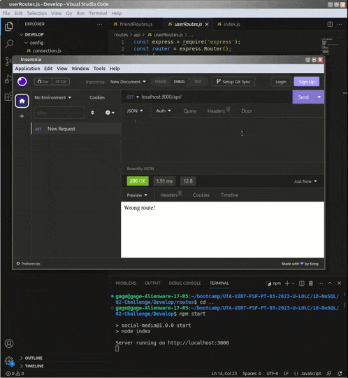

# Social Media API

## Description
This is the foundation for a NoSQL table for a social network site. My motivation was to see how NoSQL can best be implemented in a site that requires posts, users, friends, and replies. It lays the groundwork for the table and how certain HTTP methods can call upon CRUD actions.


## Installation

This project requires the installation of:
 - Node.js
 - NPM
 - Express.js
 - Mongoose

## Usage

Below is an example of various HTTP methods being used to interact with the application:



```
